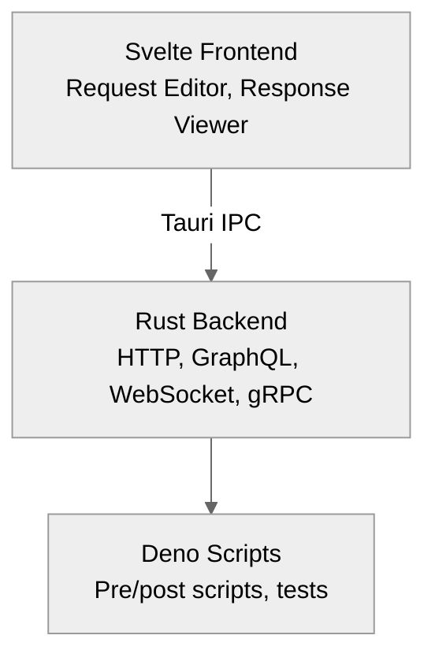

# Arcanine

<div align="center">

**A modern, offline-first REST API client with git-friendly file-based storage**

[](https://opensource.org/licenses/MIT)
[](https://tauri.app)
[](https://svelte.dev)

[](https://sonarcloud.io/summary/new_code?id=lanthoor_arcanine)
[](https://sonarcloud.io/summary/new_code?id=lanthoor_arcanine)
[](https://sonarcloud.io/summary/new_code?id=lanthoor_arcanine)
[](https://sonarcloud.io/summary/new_code?id=lanthoor_arcanine)
[](https://sonarcloud.io/summary/new_code?id=lanthoor_arcanine)

[Features](#features) • [Installation](#installation) • [Quick Start](#quick-start) • [Documentation](#documentation)

</div>

---

## Why Arcanine?

Built for developers who value **version control**, **offline capability**, and **team collaboration** without cloud lock-in.

✅ **Git-friendly** - Each request is a separate YAML file  
✅ **Offline-first** - No cloud sync required  
✅ **Lightweight** - Native Tauri app vs ~150MB Electron apps  
✅ **Secure** - Local-only data storage  
✅ **Team-friendly** - Share via Git repositories

**Current Status**: Phase 4.3 Complete - Collection Management Commands ✅  
**Version**: 0.4.3

## Features

### Implemented ✅

- ✅ **HTTP Client**: All methods (GET, POST, PUT, PATCH, DELETE, HEAD, OPTIONS)
- ✅ **Request Editor**: Headers, body, URL with validation
- ✅ **Response Viewer**: Syntax highlighting, formatting, statistics
- ✅ **Themes**: Light and dark modes with smooth transitions
- ✅ **Internationalization**: 5 languages (English, Spanish, French, German, Japanese)
- ✅ **File Storage**: YAML-based with atomic writes
- ✅ **Collection Manager**: File watching, O(1) indexing, auto-reload
- ✅ **Collection Commands**: 7 Tauri commands for full CRUD operations
- ✅ **Tabbed Interface**: Multiple requests with response caching
- ✅ **Testing**: 410 tests with 95.88% frontend, 81.96% backend coverage

### In Development ⏳

- ⏳ **Collection UI**: Frontend collection management interface (Phase 4.4)
- ⏳ **Variables**: Collection and environment variables with {{syntax}} (Phase 5)
- ⏳ **Environments**: Multiple environments with switching (Phase 6)
- ⏳ **Folders**: Hierarchical folder organization (Phase 8)

### Planned 📋

- 📋 **Authentication**: Bearer, Basic, OAuth 2.0, API Key, AWS SigV4 (Phase 9, 16)
- 📋 **Scripting**: Deno-powered pre/post-request scripts and tests (Phase 11)
- 📋 **History**: SQLite-based request/response history (Phase 10)
- 📋 **Import/Export**: Postman, Insomnia, cURL, OpenAPI (Phase 13)
- 📋 **GraphQL**: Native GraphQL support (Phase 14)
- 📋 **WebSocket**: WebSocket connections (Phase 14)

[→ Full roadmap](docs/plan/README.md)

## Installation

**Note**: Arcanine is currently in active development (Phase 4.2). Binary releases will be available at V1.0.

### Development Build

To run from source:

```bash
# Clone repository
git clone https://github.com/lanthoor/arcanine.git
cd arcanine

# Install dependencies
npm install

# Run development build
npm run tauri dev
```

See [SETUP.md](SETUP.md) for detailed development environment setup.

### Future Releases (V1.0+)

Planned distribution methods:

- **macOS**: Homebrew, DMG installer
- **Linux**: .deb, .rpm, AppImage, AUR package
- **Windows**: MSI installer, winget

[→ Track V1.0 release progress](docs/plan/README.md#milestone-4-polish--release-phases-15-19)

## Documentation

### Getting Started

- **[Collection Structure](docs/architecture/collection-structure.md)** - Organize your requests
- **[YAML Schema Reference](docs/architecture/yaml-schema.md)** - Complete schema documentation

### Core Concepts

- **[YAML Schema Reference](docs/architecture/yaml-schema.md)** - Complete schema docs
- **[Authentication Guide](docs/architecture/authentication.md)** - All auth methods
- **[Scripting Guide](docs/architecture/scripting.md)** - Scripts and testing

### Advanced

- **[Architecture Overview](docs/architecture/README.md)** - Technical design
- **[Import/Export](docs/architecture/import-export.md)** - Migrate from other tools

### Contributing

- **[Contributing Guide](CONTRIBUTING.md)** - How to contribute
- **[License](LICENSE.md)** - MIT License

## Architecture



**Built with**: Tauri 2.x • Svelte 5 • TypeScript 5.6 • TailwindCSS v4 • svelte-i18n • YAML

[→ Detailed architecture documentation](docs/architecture/README.md)

## Development

Interested in contributing? See the [Contributing Guide](CONTRIBUTING.md) for:

- Development environment setup
- Build commands and scripts
- Coding standards and guidelines
- Testing requirements
- Pull request process

## Comparison

| Feature        | Arcanine | Postman | Insomnia |
| -------------- | :------: | :-----: | :------: |
| Offline-first  |    ✅    |   ❌    |    ✅    |
| Git-friendly   |    ✅    |   ❌    |    ⚠️    |
| File-based     | ✅ YAML  |   ❌    | ✅ JSON  |
| Size           |  ~600KB  | ~200MB  |  ~150MB  |
| Open source    |    ✅    |   ❌    |    ✅    |
| Deno scripting |    ✅    | Node.js | Node.js  |

## Support

- 📖 [Documentation](docs/architecture/README.md)
- 🐛 [Issue Tracker](https://github.com/lanthoor/arcanine/issues)
- 💬 [Discussions](https://github.com/lanthoor/arcanine/discussions)

## License

[MIT License](LICENSE.md) - see the license file for details.

---

<div align="center">

**Made with ❤️ by developers, for developers**

[⬆ back to top](#arcanine)

</div>
