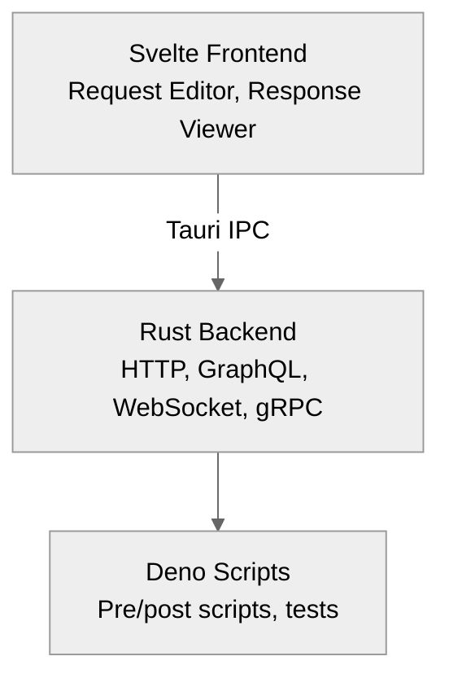

# Arcanine

<div align="center">

**A modern, offline-first REST API client with git-friendly file-based storage**

[](https://opensource.org/licenses/MIT)
[](https://tauri.app)
[](https://svelte.dev)

[](https://codecov.io/github/lanthoor/arcanine)

[Features](#features) • [Installation](#installation) • [Quick Start](#quick-start) • [Documentation](#documentation)

</div>

---

## Why Arcanine?

Built for developers who value **version control**, **offline capability**, and **team collaboration** without cloud lock-in.

✅ **Git-friendly** - Each request is a separate YAML file  
✅ **Offline-first** - No cloud sync required  
✅ **Lightweight** - ~600KB binary vs ~150MB Electron apps  
✅ **Secure** - Sandboxed scripts, local secrets  
✅ **Team-friendly** - Share via Git repositories

## Features

- **Protocols**: HTTP, GraphQL, WebSocket, gRPC
- **Authentication**: Bearer, Basic, OAuth 2.0, API Key, Digest, AWS SigV4
- **Scripting**: Deno-powered pre/post-request scripts and tests
- **Environments**: Multiple environments with secret management
- **Organization**: Hierarchical folders with self-contained ordering
- **Collaboration**: Git-based sharing, import from Postman/Insomnia
- **Cross-platform**: macOS, Linux, Windows

[→ See all features](docs/architecture/README.md#overview)

## Installation

### macOS

```bash
brew install arcanine  # Coming soon
```

### Linux

```bash
# Debian/Ubuntu
wget https://github.com/lanthoor/arcanine/releases/latest/download/arcanine_amd64.deb
sudo dpkg -i arcanine_amd64.deb

# Arch Linux
yay -S arcanine
```

### Windows

```powershell
winget install arcanine
```

[→ All installation methods](docs/architecture/README.md#installation)

## Quick Start

### 1. Create a Collection

```bash
mkdir my-api && cd my-api
```

Create `collection.yaml`:

```yaml
version: '1.0'
name: 'My API'
variables:
  baseUrl: 'http://localhost:3000'
```

### 2. Add a Request

Create `get-users.request.yaml`:

```yaml
version: '1.0'
name: 'Get Users'
order: 1

request:
  method: 'GET'
  url: '{{baseUrl}}/api/users'
  headers:
    - key: 'Authorization'
      value: 'Bearer {{token}}'
      enabled: true

tests:
  - name: 'Status is 200'
    script: assert(response.status === 200);
```

### 3. Create Environment

Create `environments/development.yaml`:

```yaml
version: '1.0'
name: 'Development'
variables:
  baseUrl: 'http://localhost:3000'
  token: 'dev-token-123'
```

### 4. Open in Arcanine

```bash
arcanine open my-api
```

[→ More examples and details](docs/architecture/collection-structure.md)

## Documentation

### Getting Started

- **[Collection Structure](docs/architecture/collection-structure.md)** - Organize your requests
- **[Environment Management](docs/architecture/environments.md)** - Multiple environments

### Core Concepts

- **[YAML Schema Reference](docs/architecture/yaml-schema.md)** - Complete schema docs
- **[Authentication Guide](docs/architecture/authentication.md)** - All auth methods
- **[Scripting Guide](docs/architecture/scripting.md)** - Scripts and testing

### Advanced

- **[Architecture Overview](docs/architecture/README.md)** - Technical design
- **[Import/Export](docs/architecture/import-export.md)** - Migrate from other tools

### Contributing

- **[Contributing Guide](CONTRIBUTING.md)** - How to contribute
- **[License](LICENSE.md)** - MIT License

## Architecture



**Built with**: Tauri 2.x • Svelte 5 • TypeScript 5.6 • TailwindCSS v4 • svelte-i18n • YAML

[→ Detailed architecture documentation](docs/architecture/README.md)

## Development

```bash
# Clone and setup
git clone https://github.com/lanthoor/arcanine.git
cd arcanine
npm install

# Run development mode (frontend only)
npm run dev

# Run Tauri application in development
npm run tauri dev

# Build for production
npm run build
npm run tauri build

# Type checking
npm run check

# Linting and formatting
npm run lint
npm run format

# Testing
npm run test              # Frontend tests (watch mode)
npm run test:run          # Frontend tests (single run)
npm run test:coverage     # Frontend coverage report
npm run test:rust         # Backend tests
npm run test:rust:coverage # Backend coverage report
```

[→ Complete development guide](CONTRIBUTING.md#development-setup)

## Comparison

| Feature        | Arcanine | Postman | Insomnia |
| -------------- | :------: | :-----: | :------: |
| Offline-first  |    ✅    |   ❌    |    ✅    |
| Git-friendly   |    ✅    |   ❌    |    ⚠️    |
| File-based     | ✅ YAML  |   ❌    | ✅ JSON  |
| Size           |  ~600KB  | ~200MB  |  ~150MB  |
| Open source    |    ✅    |   ❌    |    ✅    |
| Deno scripting |    ✅    | Node.js | Node.js  |

## Support

- 📖 [Documentation](docs/architecture/README.md)
- 🐛 [Issue Tracker](https://github.com/lanthoor/arcanine/issues)
- 💬 [Discussions](https://github.com/lanthoor/arcanine/discussions)

## License

[MIT License](LICENSE.md) - see the license file for details.

---

<div align="center">

**Made with ❤️ by developers, for developers**

[⬆ back to top](#arcanine)

</div>
