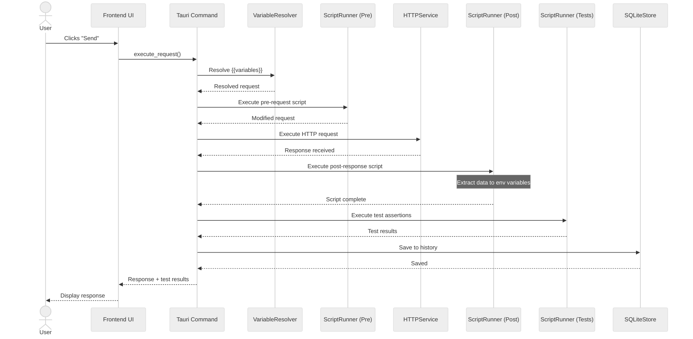
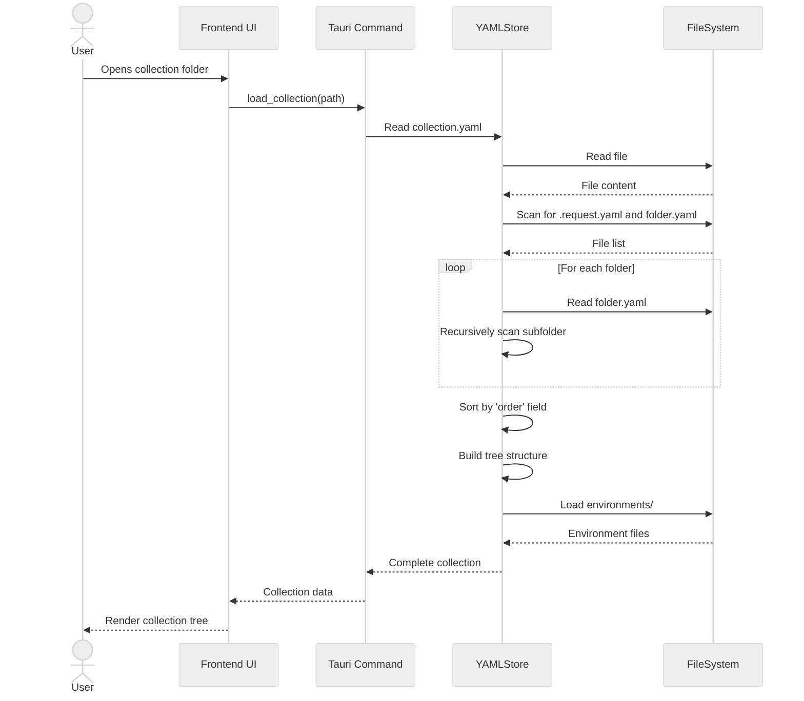
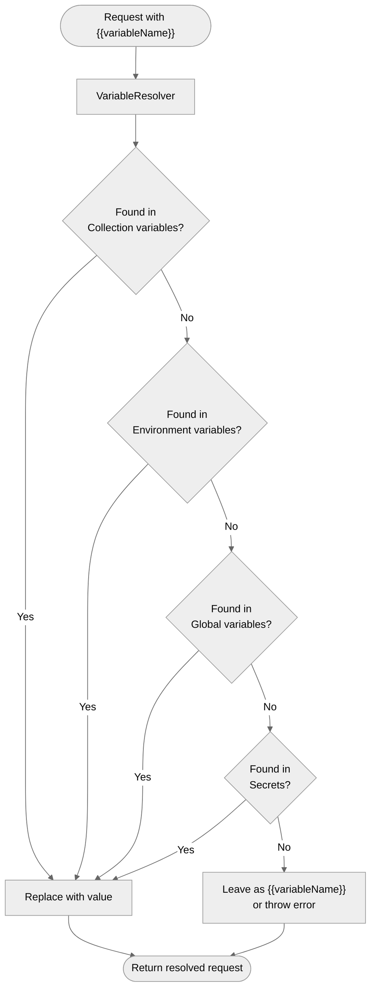

# Arcanine Architecture

This document provides a comprehensive overview of Arcanine's architecture, design decisions, and technical implementation.

## Table of Contents

- [Overview](#overview)
- [Technology Stack](#technology-stack)
- [System Architecture](#system-architecture)
- [Project Structure](#project-structure)
- [Core Components](#core-components)
- [Data Flow](#data-flow)
- [Design Decisions](#design-decisions)
- [Performance Considerations](#performance-considerations)

## Overview

Arcanine is a modern REST API client built with offline-first principles and git-friendly file-based storage. The architecture is designed to be:

- **Lightweight**: Small binary size (~600KB) compared to Electron-based alternatives
- **Fast**: Native performance with Rust backend
- **Secure**: Sandboxed script execution with Deno
- **Maintainable**: Clear separation of concerns between layers
- **Extensible**: Plugin-ready architecture for future enhancements

## Technology Stack

### Frontend

- **Svelte 5**: Reactive UI framework with minimal runtime overhead
- **SvelteKit**: Application framework for routing and SSR
- **TailwindCSS**: Utility-first CSS framework
- **Monaco Editor**: Code editor component (same as VS Code)
- **TypeScript**: Type-safe JavaScript

### Backend

- **Tauri 2.x**: Cross-platform desktop framework using Rust
- **Rust**: Systems programming language for performance and safety
- **reqwest**: HTTP client library
- **tokio**: Async runtime for Rust
- **sqlx**: SQL toolkit with compile-time checked queries
- **serde/serde_yaml**: Serialization/deserialization

### Script Runtime

- **Deno Core**: Embedded JavaScript/TypeScript runtime
- **V8**: JavaScript engine with sandboxed execution
- **Custom APIs**: Exposed environment and request manipulation APIs

### Storage

- **YAML**: Human-readable format for collections and environments
- **SQLite**: Embedded database for request/response history
- **File System**: Direct file operations for collection management

## System Architecture

```mermaid
%%{init: {'theme':'neutral'}}%%
flowchart TB
    subgraph ArcanineApp["Arcanine Application"]
        subgraph Frontend["Svelte Frontend (UI Layer)"]
            RequestEditor["Request Editor"]
            ResponseViewer["Response Viewer"]
            CollectionTree["Collection Tree"]
            EnvSelector["Environment Selector"]
            HistoryPanel["History Panel"]
            SettingsManager["Settings Manager"]
            CodeEditor["Code Editor"]
            TestResults["Test Results"]
        end

        subgraph Backend["Rust Backend (Business Logic)"]
            subgraph Commands["Command Layer (Tauri Commands)"]
                RequestCmd["request_command"]
                CollectionCmd["collection_command"]
                EnvCmd["environment_command"]
                HistoryCmd["history_command"]
                ScriptCmd["script_command"]
                AuthCmd["auth_command"]
            end

            subgraph Services["Service Layer (Core Logic)"]
                HTTPService["HTTPService"]
                GraphQLService["GraphQLService"]
                WebSocketService["WebSocketService"]
                gRPCService["gRPCService"]
                VariableResolver["VariableResolver"]
                ScriptRunner["ScriptRunner"]
                AuthService["AuthService"]
                FileWatcher["FileWatcher"]
            end

            subgraph Storage["Storage Layer (Persistence)"]
                YAMLStore["YAMLStore"]
                SQLiteStore["SQLiteStore"]
                FileSystem["FileSystem"]
                CacheManager["CacheManager"]
            end
        end

        subgraph DenoRuntime["Deno Script Runtime (Sandboxed)"]
            PreRequestScripts["Pre-request Scripts"]
            PostResponseScripts["Post-response Scripts"]
            TestAssertions["Test Assertions"]
            VariableManip["Variable Manipulation"]
            ConsoleLogging["Console Logging"]
            AsyncOps["Async Operations"]
        end
    end

    subgraph OS["Operating System"]
        FileSystemOS["File System"]
        NetworkStack["Network Stack"]
        ProcessMgmt["Process Management"]
    end

    Frontend -->|"Tauri IPC<br/>(JSON-RPC over WebSocket)"| Commands
    Commands --> Services
    Services --> Storage
    Backend -.->|"System Calls"| OS
```



## Project Structure

```
arcanine/
├── src/                          # Frontend (Svelte)
│   ├── lib/
│   │   ├── components/          # UI Components
│   │   │   ├── request/         # Request editor components
│   │   │   ├── response/        # Response viewer components
│   │   │   ├── collection/      # Collection tree components
│   │   │   ├── environment/     # Environment management
│   │   │   ├── history/         # History panel
│   │   │   └── ui/              # Shared UI primitives
│   │   ├── stores/              # Svelte stores (state)
│   │   │   ├── collections.ts
│   │   │   ├── environments.ts
│   │   │   ├── requests.ts
│   │   │   ├── history.ts
│   │   │   └── settings.ts
│   │   ├── services/            # Frontend services
│   │   │   ├── api.ts           # Tauri command wrappers
│   │   │   ├── import.ts        # Import handlers
│   │   │   └── export.ts        # Export handlers
│   │   └── utils/               # Utilities
│   ├── routes/                  # SvelteKit routes
│   └── app.css                  # Global styles
│
├── src-tauri/                   # Backend (Rust)
│   ├── src/
│   │   ├── lib.rs               # Library exports
│   │   ├── main.rs              # Application entry point
│   │   ├── commands/            # Tauri command handlers (TODO)
│   │   │   ├── mod.rs
│   │   │   ├── request.rs       # HTTP/GraphQL/WS/gRPC
│   │   │   ├── collection.rs    # Collection CRUD
│   │   │   ├── environment.rs   # Environment management
│   │   │   ├── history.rs       # History operations
│   │   │   ├── script.rs        # Script execution
│   │   │   └── auth.rs          # Authentication
│   │   ├── models/              # Data structures ✅ COMPLETE
│   │   │   ├── mod.rs           # Module exports
│   │   │   ├── error.rs         # Error types and ModelResult
│   │   │   ├── request.rs       # Request model with HttpMethod
│   │   │   ├── response.rs      # Response model with Duration
│   │   │   └── collection.rs    # Collection model with metadata
│   │   ├── services/            # Business logic
│   │   │   ├── mod.rs
│   │   │   ├── http_service.rs  # HTTP client
│   │   │   ├── graphql_service.rs
│   │   │   ├── websocket_service.rs
│   │   │   ├── grpc_service.rs
│   │   │   ├── variable_resolver.rs
│   │   │   ├── script_runner.rs # Deno integration
│   │   │   └── file_watcher.rs  # Watch YAML changes
│   │   ├── storage/             # Persistence layer
│   │   │   ├── mod.rs
│   │   │   ├── yaml_store.rs    # YAML operations
│   │   │   └── sqlite_store.rs  # SQLite operations
│   │   └── utils/               # Utilities
│   │       ├── mod.rs
│   │       └── error.rs         # Error types
│   ├── Cargo.toml               # Rust dependencies
│   ├── tauri.conf.json          # Tauri configuration
│   └── migrations/              # Database migrations
│       └── 001_initial.sql
│
├── docs/                        # Documentation
│   └── architecture/            # Architecture docs
│
├── collections/                 # Example collections
│   └── example/
│
├── scripts/                     # Build scripts
│
├── package.json                 # Node.js dependencies
├── svelte.config.js             # Svelte configuration
├── vite.config.ts               # Vite bundler config
├── tailwind.config.js           # Tailwind configuration
├── tsconfig.json                # TypeScript config
├── README.md
├── LICENSE.md
└── CONTRIBUTING.md
```

## Core Components

### 1. Frontend Layer (Svelte)

#### Request Editor

- **Purpose**: Compose and configure HTTP requests
- **Components**: URL bar, method selector, headers editor, body editor, auth config
- **Features**: Auto-completion, syntax highlighting, variable interpolation preview

#### Response Viewer

- **Purpose**: Display and analyze API responses
- **Components**: Status display, headers viewer, body viewer, stats panel
- **Features**: JSON/XML formatting, search, image preview, syntax highlighting

#### Collection Tree

- **Purpose**: Navigate and organize requests
- **Components**: Tree view, drag-drop, context menu
- **Features**: Hierarchical display, search, filtering, ordering management

#### Environment Selector

- **Purpose**: Manage multiple environments
- **Components**: Dropdown selector, variable editor, secret manager
- **Features**: Quick switching, variable preview, validation

### 2. Backend Layer (Rust)

#### Command Layer

Tauri commands that expose backend functionality to the frontend:

```rust
#[tauri::command]
async fn execute_request(
    request: RequestModel,
    environment: EnvironmentModel,
) -> Result<ResponseModel, Error> {
    // 1. Resolve variables
    // 2. Run pre-request script
    // 3. Execute HTTP request
    // 4. Run post-response script
    // 5. Run tests
    // 6. Store in history
    // 7. Return response
}
```

#### Service Layer

Business logic implementation:

- **HTTPService**: Handle HTTP requests using reqwest
- **GraphQLService**: GraphQL query execution and schema introspection
- **WebSocketService**: Manage WebSocket connections
- **gRPCService**: gRPC client using tonic
- **VariableResolver**: Replace `{{variables}}` with actual values
- **ScriptRunner**: Execute Deno scripts in sandboxed environment
- **AuthService**: Handle different authentication mechanisms

#### Storage Layer

Data persistence:

- **YAMLStore**: Read/write YAML files for collections
- **SQLiteStore**: Manage request/response history
- **FileWatcher**: Detect external changes to YAML files

### 3. Script Runtime (Deno)

#### Custom APIs Exposed to Scripts

```javascript
// Environment variable access
env.get(key: string): string | undefined
env.set(key: string, value: string): void
env.delete(key: string): void

// Collection-level variables
collection.get(key: string): string | undefined
collection.set(key: string, value: string): void

// Request manipulation
request.url: string
request.method: string
request.headers: Map<string, string>
request.body: string

// Response access (in post-response scripts)
response.status: number
response.statusText: string
response.headers: Map<string, string>
response.body: string
response.time: number (milliseconds)
response.size: number (bytes)
response.json(): any
response.text(): string

// Assertions
assert(condition: boolean, message?: string): void

// Console logging
console.log(...args): void
console.error(...args): void
console.warn(...args): void
```

## Data Flow

### Request Execution Flow



### Collection Loading Flow



### Environment Variable Resolution



## Design Decisions

### 1. Why Tauri over Electron?

**Decision**: Use Tauri instead of Electron

**Rationale**:

- **Size**: ~600KB vs ~150MB (250x smaller)
- **Performance**: Native Rust backend vs Node.js
- **Memory**: Lower memory footprint
- **Security**: Rust's memory safety + sandboxed frontend
- **Speed**: Faster startup and runtime performance

**Trade-offs**:

- Smaller ecosystem than Electron
- Requires Rust knowledge for backend development
- Less mature (but stable and production-ready)

### 2. Why Svelte over React/Vue?

**Decision**: Use Svelte 5 instead of React or Vue

**Rationale**:

- **Bundle Size**: Smallest framework, no virtual DOM overhead
- **Performance**: Compile-time optimization, reactive by default
- **Developer Experience**: Less boilerplate, cleaner syntax
- **Speed**: Fastest framework in benchmarks

**Trade-offs**:

- Smaller community than React
- Fewer third-party components
- Less job market demand (but growing)

### 3. Why Deno over Node.js for Scripts?

**Decision**: Use Deno runtime instead of Node.js

**Rationale**:

- **Security**: Sandboxed by default, no file system access unless granted
- **Modern**: Native TypeScript, ESM modules
- **No node_modules**: Simpler dependency management
- **Standard Library**: Built-in utilities
- **Permissions**: Granular control over capabilities

**Trade-offs**:

- Smaller ecosystem than Node.js
- Some npm packages may not work
- Additional runtime to embed

### 4. Why YAML over JSON for Collections?

**Decision**: Use YAML instead of JSON

**Rationale**:

- **Readability**: Comments, multi-line strings, cleaner syntax
- **Git-friendly**: Better diff visualization
- **Flexibility**: Less punctuation, easier to write
- **Documentation**: Built-in comment support

**Trade-offs**:

- Slightly slower parsing than JSON
- More prone to indentation errors
- Less universal than JSON

### 5. Why SQLite for History?

**Decision**: Use SQLite instead of YAML files

**Rationale**:

- **Performance**: Fast queries and indexing
- **Scalability**: Handle thousands of history entries
- **Queries**: Complex filtering and searching
- **Atomic**: ACID transactions
- **Standard**: Well-tested and stable

**Trade-offs**:

- Binary format (not human-readable)
- Not git-friendly (but history shouldn't be versioned)
- Requires schema migrations

### 6. Why File-per-Request?

**Decision**: Each request is a separate YAML file

**Rationale**:

- **Git-friendly**: Clear diffs, easy to track changes
- **Isolation**: Changes don't affect other requests
- **Scalability**: Large collections don't create huge files
- **Collaboration**: Reduced merge conflicts
- **Flexibility**: Easy to move/copy requests

**Trade-offs**:

- More files to manage
- Slightly slower initial load
- Requires directory scanning

### 7. Why Self-contained Ordering?

**Decision**: Each element stores its own `order` field

**Rationale**:

- **Decentralization**: No parent-child coupling
- **Git-friendly**: Moving items changes minimal files
- **Simplicity**: Clear ownership of position
- **Flexibility**: Easy reordering

**Trade-offs**:

- Requires full directory scan to determine order
- Potential order conflicts (same order number)
- More fields in each file

## Performance Considerations

### 1. Collection Loading

- **Lazy Loading**: Load folders on-demand, not all at once
- **Caching**: Cache parsed YAML in memory
- **Indexing**: Maintain in-memory index of all requests
- **File Watching**: Use efficient file system watchers

### 2. Request Execution

- **Async Operations**: All I/O is async (Tokio runtime)
- **Connection Pooling**: Reuse HTTP connections
- **Streaming**: Stream large responses instead of loading fully
- **Cancellation**: Support request cancellation

### 3. UI Performance

- **Virtual Scrolling**: Render only visible items in lists
- **Code Editor**: Use Monaco with lazy loading
- **Debouncing**: Debounce auto-save and validation
- **Web Workers**: Offload heavy computations

### 4. History Storage

- **Indexing**: Proper database indexes on common queries
- **Pagination**: Load history in chunks
- **Cleanup**: Configurable history retention policy
- **Compression**: Compress large response bodies

### 5. Memory Management

- **Response Limits**: Cap maximum response size
- **Stream Processing**: Process large files in chunks
- **Cache Eviction**: LRU cache for parsed collections
- **Rust's RAII**: Automatic resource cleanup

## Security Considerations

### 1. Script Sandboxing

- Deno's permission system (no FS access by default)
- Limited APIs exposed to scripts
- Timeout enforcement
- Memory limits

### 2. Secret Management

- Secrets stored in separate gitignored files
- Never included in requests sent to backend
- Optional encryption at rest
- Clear warnings in UI

### 3. SSL/TLS

- Certificate validation enabled by default
- Support for custom CA certificates
- Client certificate support
- Warning for self-signed certificates

### 4. Data Privacy

- All data stored locally
- No telemetry by default
- No cloud sync (unless explicitly enabled)
- Clear data ownership

## Extension Points

Future plugin system will allow:

1. **Custom Authentication Methods**: Add new auth types
2. **Request/Response Processors**: Transform data
3. **Custom Protocols**: Add new protocol support
4. **Import/Export Formats**: New format handlers
5. **UI Themes**: Custom color schemes
6. **Code Generators**: Generate client code

## Current Implementation Status

**Version**: 0.4.2  
**Status**: Phase 4.2 Complete (Collection File System)

### Implemented Features ✅

#### Phase 1-2: Foundation & HTTP Client

- ✅ Tauri 2.x + Svelte 5 project structure
- ✅ TypeScript with strict mode
- ✅ Theme system (light/dark)
- ✅ Internationalization (5 languages: en, es, fr, de, ja)
- ✅ Testing infrastructure (Vitest, cargo-tarpaulin)
- ✅ Core data models (Request, Response, Collection)
- ✅ HTTP service with reqwest (all methods)
- ✅ In-memory request storage (RequestStore)
- ✅ Tauri commands for IPC

#### Phase 3: UI Implementation

- ✅ Request list component
- ✅ Request editor with validation
- ✅ Response viewer with formatting
- ✅ Tabbed interface with caching
- ✅ Theme toggle
- ✅ Language switcher
- ✅ Collapsible sidebar
- ✅ Layout toggle (horizontal/vertical)
- ✅ Bottom toolbar
- ✅ Preferences pane

#### Phase 4: File Storage

- ✅ YAML storage implementation (YAMLStore)
- ✅ Collection file system (CollectionManager)
- ✅ File watching with notify
- ✅ O(1) request indexing
- ✅ Atomic file writes
- ✅ Collection metadata

### Pending Features ⏳

#### Phase 4-6: Data Management & Variables (Next)

- ⏳ File management commands (Phase 4.3)
- ⏳ Collection UI updates (Phase 4.4-4.6)
- ⏳ Variables system (Phase 5)
- ⏳ Environments (Phase 6)
- ⏳ Secrets management (Phase 7)

#### Phase 8-14: Advanced Features

- ⏳ Folder hierarchy (Phase 8)
- ⏳ Advanced request features (Phase 9)
- ⏳ Request history with SQLite (Phase 10)
- ⏳ Scripts & testing with Deno (Phase 11)
- ⏳ Enhanced response processing (Phase 12)
- ⏳ Import/Export (Postman, cURL, OpenAPI) (Phase 13)
- ⏳ GraphQL & WebSocket support (Phase 14)

#### Phase 15-19: Polish & Release

- ⏳ Performance optimization (Phase 15)
- ⏳ Accessibility (WCAG AAA) (Phase 15)
- ⏳ Advanced authentication (OAuth, AWS Sig V4) (Phase 16)
- ⏳ File watching & collaboration (Phase 17)
- ⏳ Comprehensive testing & QA (Phase 18)
- ⏳ V1.0 release preparation (Phase 19)

### Project Metrics

- **Total Tests**: 308 (199 frontend + 109 backend)
- **Frontend Coverage**: 95.88%
- **Backend Coverage**: 90.91%
- **Components**: 10 UI components + 4 stores
- **Storage Modules**: 3 (RequestStore, YAMLStore, CollectionManager)
- **i18n Languages**: 5 with 525+ keys each
- **Lines of Code**: ~5,000 (frontend) + ~2,500 (backend)

## Project Structure

```
arcanine/
├── src/                          # Frontend (Svelte 5 + TypeScript)
│   ├── lib/
│   │   ├── components/          # 10 UI components
│   │   │   ├── ThemeToggle.svelte
│   │   │   ├── LanguageSwitcher.svelte
│   │   │   ├── RequestList.svelte
│   │   │   ├── RequestEditor.svelte
│   │   │   ├── ResponseViewer.svelte
│   │   │   ├── TabBar.svelte
│   │   │   ├── BottomToolbar.svelte
│   │   │   └── PreferencesPane.svelte
│   │   ├── i18n/                # Internationalization
│   │   │   ├── index.ts
│   │   │   └── locales/         # en, es, fr, de, ja
│   │   └── stores/              # 4 Svelte stores
│   │       ├── theme.ts
│   │       ├── ui.ts
│   │       ├── tabs.ts
│   │       └── responses.ts
│   ├── routes/                  # SvelteKit routes
│   ├── test/                    # 199 tests, 95.88% coverage
│   └── app.css                  # Theme CSS variables
│
├── src-tauri/                   # Backend (Rust + Tauri 2.x)
│   └── src/
│       ├── models/              # Data models
│       │   ├── request.rs
│       │   ├── response.rs
│       │   ├── collection.rs
│       │   └── error.rs
│       ├── services/            # Business logic
│       │   └── http.rs          # HTTP client with reqwest
│       ├── storage/             # Persistence layer
│       │   ├── request_store.rs # In-memory storage
│       │   ├── yaml_store.rs    # File I/O
│       │   └── collection_manager.rs # 908 LOC, file watching
│       └── commands/            # Tauri commands
│           └── requests.rs      # IPC commands
│
└── docs/                        # Documentation
    ├── architecture/            # Technical architecture
    │   ├── README.md            # This file
    │   ├── data-models.md       # Model specifications
    │   ├── collection-structure.md # File format
    │   ├── yaml-schema.md       # YAML schema
    │   ├── arcanine-collection.json # JSON schema
    │   ├── import-export.md     # Import/export guide
    │   ├── scripting.md         # Scripting guide (planned)
    │   ├── authentication.md    # Auth guide (planned)
    │   ├── theming.md           # Theme system
    │   ├── i18n.md              # i18n implementation
    │   └── testing.md           # Testing guide
    ├── plan/                    # Project vision
    │   ├── README.md            # Vision & scope
    │   └── execution-plan.md    # Detailed phase breakdown
    └── progress/                # Progress tracking
        ├── README.md            # Progress overview
        ├── summary.md           # Comprehensive summary
        └── phase-*.md           # 15 phase completion reports
```

For detailed directory structure and all files, see [SETUP.md](../../SETUP.md).

---

## Documentation Index

### Architecture & Design

- [Data Models](data-models.md) - Request, Response, Collection specifications ✅
- [Collection Structure](collection-structure.md) - File system organization ✅
- [YAML Schema Reference](yaml-schema.md) - YAML format specification ✅
- [Collection JSON Schema](arcanine-collection.json) - JSON schema definition ✅
- [Theming System](theming.md) - CSS variables and theme implementation ✅
- [Internationalization](i18n.md) - i18n architecture and translation guide ✅
- [Testing Architecture](testing.md) - Testing strategy and coverage ✅

### Features (Planned)

- [Import/Export Guide](import-export.md) - Format conversion and migration 📋
- [Scripting Guide](scripting.md) - Pre-request, post-response scripts 📋
- [Authentication Guide](authentication.md) - Auth methods and configuration 📋

### Project Documentation

- [Project Vision](../plan/README.md) - Vision, scope, and competitive analysis
- [Execution Plan](../plan/execution-plan.md) - Detailed 20-phase breakdown
- [Progress Summary](../progress/summary.md) - Current status and metrics
- [Progress Reports](../progress/) - Individual phase completion reports
- [Setup Guide](../../SETUP.md) - Development environment setup
- [Contributing Guide](../../CONTRIBUTING.md) - Contribution workflow
