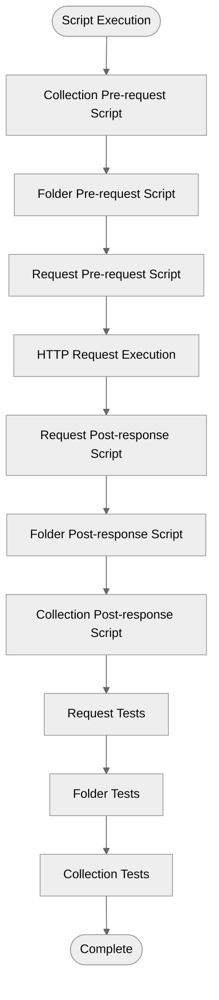

# Scripting Guide

Complete guide to writing pre-request scripts, post-response scripts, and test assertions in Arcanine.

## Table of Contents

- [Overview](#overview)
- [Script Runtime](#script-runtime)
- [Available APIs](#available-apis)
- [Pre-request Scripts](#pre-request-scripts)
- [Post-response Scripts](#post-response-scripts)
- [Test Assertions](#test-assertions)
- [Common Patterns](#common-patterns)
- [Best Practices](#best-practices)
- [Examples](#examples)

## Overview

Arcanine uses **Deno** as the JavaScript runtime for executing scripts. Scripts can be defined at three levels:

1. **Collection Level** - Runs for every request in the collection
2. **Folder Level** - Runs for every request in the folder
3. **Request Level** - Runs only for that specific request

### Execution Order



## Script Runtime

### Deno Runtime Features

- **TypeScript Support**: Write scripts in TypeScript or JavaScript
- **Secure by Default**: No file system access, no network access (except HTTP requests)
- **Modern APIs**: ES modules, async/await, Promises
- **Standard Library**: Access to Deno's standard library

### Limitations

Scripts run in a sandboxed environment with:

- **No File System Access**: Cannot read or write files
- **No Network Access**: Cannot make external network calls (only the main request)
- **Memory Limits**: Scripts are terminated if they exceed memory limits
- **Timeout**: Scripts timeout after 30 seconds (configurable)

## Available APIs

### Environment Variables

```typescript
// Get environment variable
const baseUrl = env.get('baseUrl');
// Returns: string | undefined

// Set environment variable
env.set('authToken', 'abc123');

// Delete environment variable
env.delete('tempVar');

// Check if variable exists
if (env.get('apiKey')) {
  // Variable exists
}
```

### Collection Variables

```typescript
// Get collection-level variable
const lastRequestTime = collection.get('lastRequestTime');

// Set collection-level variable
collection.set('requestCount', '42');

// Delete collection-level variable
collection.delete('tempData');
```

### Request Object

Available in **pre-request scripts**:

```typescript
// URL
console.log(request.url);
// e.g., "https://api.example.com/users"

// Method
console.log(request.method);
// e.g., "GET", "POST", etc.

// Headers (Map)
request.headers.set('X-Custom-Header', 'value');
request.headers.get('Authorization');
request.headers.delete('X-Remove-This');
request.headers.has('Content-Type');

// Iterate headers
for (const [key, value] of request.headers) {
  console.log(`${key}: ${value}`);
}

// Body (string)
console.log(request.body);

// Modify body
request.body = JSON.stringify({
  email: env.get('email'),
  password: env.get('password'),
});
```

### Response Object

Available in **post-response scripts** and **tests**:

```typescript
// Status code
console.log(response.status);
// e.g., 200, 404, 500

// Status text
console.log(response.statusText);
// e.g., "OK", "Not Found"

// Headers (Map)
const contentType = response.headers.get('Content-Type');

// Iterate headers
for (const [key, value] of response.headers) {
  console.log(`${key}: ${value}`);
}

// Body (string)
console.log(response.body);

// Parse JSON
const data = response.json();
// Returns: any (parsed JSON object)

// Get text
const text = response.text();
// Returns: string

// Response time (milliseconds)
console.log(response.time);
// e.g., 245

// Response size (bytes)
console.log(response.size);
// e.g., 1024
```

### Assertions

Available in **test scripts**:

```typescript
// Basic assertion
assert(condition: boolean, message?: string): void

// Example
assert(response.status === 200, "Expected 200 OK");

// If condition is false, test fails with message
```

### Console Logging

```typescript
// Log message
console.log('Request executed');

// Log with variables
console.log('Token:', env.get('token'));

// Error logging
console.error('Failed to authenticate');

// Warning
console.warn('Deprecated endpoint');

// Multiple arguments
console.log('User:', data.user.name, 'ID:', data.user.id);
```

### Crypto

```typescript
// Generate UUID
const requestId = crypto.randomUUID();
// Returns: "550e8400-e29b-41d4-a716-446655440000"

// Use in request
request.headers.set('X-Request-ID', requestId);
```

### Date/Time

```typescript
// Current timestamp
const now = new Date();
console.log(now.toISOString());
// "2024-11-29T16:15:00.000Z"

// Unix timestamp
const timestamp = Date.now();
console.log(timestamp);
// 1701275700000

// Format for header
request.headers.set('X-Timestamp', now.toISOString());
```

## Pre-request Scripts

Pre-request scripts run **before** the HTTP request is sent. Use them to:

- Set dynamic values
- Generate authentication tokens
- Validate input
- Modify request headers/body
- Calculate checksums

### Basic Example

```yaml
preRequestScript: |
  // Add timestamp to request
  const timestamp = new Date().toISOString();
  request.headers.set("X-Timestamp", timestamp);

  // Add request ID
  const requestId = crypto.randomUUID();
  request.headers.set("X-Request-ID", requestId);

  console.log(`Request ${requestId} at ${timestamp}`);
```

### Validation Example

```yaml
preRequestScript: |
  // Validate required environment variables
  const apiKey = env.get("apiKey");
  if (!apiKey) {
    throw new Error("API key not set in environment");
  }

  const email = env.get("userEmail");
  if (!email || !email.includes("@")) {
    throw new Error("Invalid email address");
  }

  console.log("✓ Validation passed");
```

### Dynamic Body Generation

```yaml
preRequestScript: |
  // Generate dynamic request body
  const body = {
    email: env.get("userEmail"),
    password: env.get("userPassword"),
    timestamp: Date.now(),
    nonce: crypto.randomUUID()
  };

  request.body = JSON.stringify(body);
  console.log("Generated request body:", body);
```

### Conditional Headers

```yaml
preRequestScript: |
  // Add auth header only if token exists
  const token = env.get("authToken");
  if (token) {
    request.headers.set("Authorization", `Bearer ${token}`);
    console.log("✓ Authorization header added");
  } else {
    console.warn("⚠ No auth token found");
  }
```

## Post-response Scripts

Post-response scripts run **after** receiving the HTTP response. Use them to:

- Extract data from responses
- Save tokens to environment
- Update collection state
- Parse response data
- Log response details

### Basic Example

```yaml
postResponseScript: |
  // Log response details
  console.log(`Status: ${response.status} ${response.statusText}`);
  console.log(`Time: ${response.time}ms`);
  console.log(`Size: ${response.size} bytes`);

  // Parse and log data
  if (response.status === 200) {
    const data = response.json();
    console.log("Response data:", data);
  }
```

### Extract Authentication Token

```yaml
postResponseScript: |
  // Extract and save auth token
  if (response.status === 200) {
    const data = response.json();
    
    if (data.accessToken) {
      env.set("authToken", data.accessToken);
      console.log("✓ Auth token saved");
      
      // Calculate expiry time
      if (data.expiresIn) {
        const expiryTime = new Date(Date.now() + data.expiresIn * 1000);
        env.set("tokenExpiry", expiryTime.toISOString());
        console.log(`Token expires at: ${expiryTime.toISOString()}`);
      }
    }
    
    if (data.refreshToken) {
      env.set("refreshToken", data.refreshToken);
      console.log("✓ Refresh token saved");
    }
  } else {
    console.error("✗ Login failed:", response.statusText);
  }
```

### Extract User Data

```yaml
postResponseScript: |
  const data = response.json();

  if (data.user) {
    // Save user data to environment
    env.set("userId", data.user.id);
    env.set("userName", data.user.name);
    env.set("userEmail", data.user.email);
    
    console.log("✓ User data saved:");
    console.log(`  ID: ${data.user.id}`);
    console.log(`  Name: ${data.user.name}`);
    console.log(`  Email: ${data.user.email}`);
  }
```

### Update Collection State

```yaml
postResponseScript: |
  // Track request count
  const currentCount = collection.get("requestCount") || "0";
  const newCount = parseInt(currentCount) + 1;
  collection.set("requestCount", newCount.toString());

  // Save last request time
  collection.set("lastRequestTime", new Date().toISOString());

  console.log(`Total requests: ${newCount}`);
```

### Error Handling

```yaml
postResponseScript: |
  try {
    const data = response.json();
    
    if (response.status >= 400) {
      console.error(`Error ${response.status}:`, data.message || data.error);
      
      // Clear auth on 401
      if (response.status === 401) {
        env.delete("authToken");
        console.log("✗ Auth token cleared due to 401");
      }
    } else {
      console.log("✓ Request successful");
    }
  } catch (error) {
    console.error("Failed to parse response:", error.message);
  }
```

## Test Assertions

Tests validate that responses meet expected criteria. All assertions use the `assert()` function.

### Basic Assertions

```yaml
tests:
  - name: 'Status code is 200'
    script: |
      assert(response.status === 200, `Expected 200, got ${response.status}`);

  - name: 'Response time is acceptable'
    script: |
      assert(response.time < 1000, `Response took ${response.time}ms, expected < 1000ms`);

  - name: 'Response has content'
    script: |
      assert(response.size > 0, "Response body is empty");
```

### Header Assertions

```yaml
tests:
  - name: 'Content-Type is JSON'
    script: |
      const contentType = response.headers.get("Content-Type");
      assert(
        contentType && contentType.includes("application/json"),
        `Expected JSON, got ${contentType}`
      );

  - name: 'Has CORS headers'
    script: |
      assert(
        response.headers.has("Access-Control-Allow-Origin"),
        "Missing CORS header"
      );
```

### JSON Response Assertions

```yaml
tests:
  - name: 'Response is valid JSON'
    script: |
      let data;
      try {
        data = response.json();
        assert(true, "Valid JSON");
      } catch (error) {
        assert(false, `Invalid JSON: ${error.message}`);
      }

  - name: 'Response has required fields'
    script: |
      const data = response.json();
      assert(data.id, "Missing id field");
      assert(data.name, "Missing name field");
      assert(data.email, "Missing email field");

  - name: 'User ID is a number'
    script: |
      const data = response.json();
      assert(typeof data.id === "number", `ID should be number, got ${typeof data.id}`);

  - name: 'Email is valid format'
    script: |
      const data = response.json();
      assert(
        data.email && data.email.includes("@"),
        `Invalid email: ${data.email}`
      );
```

### Array Assertions

```yaml
tests:
  - name: 'Response is an array'
    script: |
      const data = response.json();
      assert(Array.isArray(data), "Response should be an array");

  - name: 'Array is not empty'
    script: |
      const data = response.json();
      assert(data.length > 0, "Array is empty");

  - name: 'Array has expected length'
    script: |
      const data = response.json();
      assert(data.length === 10, `Expected 10 items, got ${data.length}`);

  - name: 'All items have required fields'
    script: |
      const data = response.json();
      for (const item of data) {
        assert(item.id, `Item missing id: ${JSON.stringify(item)}`);
        assert(item.name, `Item missing name: ${JSON.stringify(item)}`);
      }
```

### Complex Assertions

```yaml
tests:
  - name: 'Authentication successful'
    script: |
      const data = response.json();

      // Check status
      assert(response.status === 200, "Authentication failed");

      // Check tokens
      assert(data.accessToken, "Missing access token");
      assert(data.refreshToken, "Missing refresh token");
      assert(typeof data.accessToken === "string", "Access token should be string");

      // Check expiry
      assert(data.expiresIn, "Missing expiresIn");
      assert(data.expiresIn > 0, "Invalid expiry time");

      // Check user data
      assert(data.user, "Missing user object");
      assert(data.user.id, "Missing user ID");
      assert(data.user.email, "Missing user email");
```

## Common Patterns

### Pattern 1: Chain Requests

```yaml
# Request 1: Login
postResponseScript: |
  const data = response.json();
  env.set("authToken", data.accessToken);

# Request 2: Get Profile (uses token from Request 1)
request:
  headers:
    - key: 'Authorization'
      value: 'Bearer {{authToken}}'
```

### Pattern 2: Retry Logic

```yaml
postResponseScript: |
  if (response.status === 401) {
    // Token expired, clear it
    env.delete("authToken");
    console.log("⚠ Token expired, please re-authenticate");
  }
```

### Pattern 3: Dynamic Pagination

```yaml
postResponseScript: |
  const data = response.json();

  if (data.nextPage) {
    env.set("nextPageUrl", data.nextPage);
    console.log(`Next page available: ${data.nextPage}`);
  } else {
    env.delete("nextPageUrl");
    console.log("✓ Reached last page");
  }
```

### Pattern 4: Rate Limit Handling

```yaml
postResponseScript: |
  const remaining = response.headers.get("X-RateLimit-Remaining");
  const reset = response.headers.get("X-RateLimit-Reset");

  if (remaining) {
    console.log(`Rate limit remaining: ${remaining}`);
    
    if (parseInt(remaining) < 10) {
      console.warn("⚠ Rate limit nearly exhausted");
    }
  }

  if (response.status === 429) {
    console.error("✗ Rate limit exceeded");
    if (reset) {
      const resetDate = new Date(parseInt(reset) * 1000);
      console.log(`Rate limit resets at: ${resetDate.toISOString()}`);
    }
  }
```

### Pattern 5: Request Signing

```yaml
preRequestScript: |
  // Simple HMAC-style signing
  const timestamp = Date.now().toString();
  const nonce = crypto.randomUUID();

  // Create signature payload
  const payload = `${request.method}:${request.url}:${timestamp}:${nonce}`;

  // Add to headers
  request.headers.set("X-Timestamp", timestamp);
  request.headers.set("X-Nonce", nonce);
  request.headers.set("X-Payload", payload);

  console.log("Request signed");
```

## Best Practices

### 1. Keep Scripts Simple

```typescript
// Good: Clear and focused
const token = env.get('authToken');
if (token) {
  request.headers.set('Authorization', `Bearer ${token}`);
}

// Avoid: Complex logic that's hard to debug
```

### 2. Use Meaningful Variable Names

```typescript
// Good
const accessToken = env.get('accessToken');
const userId = env.get('userId');

// Bad
const t = env.get('t');
const id = env.get('id');
```

### 3. Add Console Logging

```typescript
// Always log important operations
console.log('✓ Token refreshed');
console.log('⚠ No auth token found');
console.error('✗ Authentication failed');
```

### 4. Handle Errors Gracefully

```typescript
try {
  const data = response.json();
  env.set('userId', data.user.id);
} catch (error) {
  console.error('Failed to parse response:', error.message);
}
```

### 5. Use Descriptive Test Names

```yaml
tests:
  # Good
  - name: 'Status code is 200 OK'
  - name: 'Response contains user data'
  - name: 'Email field matches expected format'

  # Avoid
  - name: 'Test 1'
  - name: 'Check response'
```

### 6. Validate Input

```typescript
// Always validate before using
const email = env.get('email');
if (!email || !email.includes('@')) {
  throw new Error('Invalid email address');
}
```

### 7. Clean Up Temporary Variables

```typescript
// Set temporary variable
env.set('tempRequestId', crypto.randomUUID());

// Use it...

// Clean up
env.delete('tempRequestId');
```

## Examples

### Complete Authentication Flow

```yaml
# Login Request
preRequestScript: |
  // Validate credentials exist
  const email = env.get("userEmail");
  const password = env.get("userPassword");

  if (!email || !password) {
    throw new Error("Missing credentials");
  }

  console.log(`Logging in as: ${email}`);

postResponseScript: |
  if (response.status === 200) {
    const data = response.json();
    
    // Save tokens
    env.set("accessToken", data.accessToken);
    env.set("refreshToken", data.refreshToken);
    
    // Save user info
    env.set("userId", data.user.id);
    env.set("userName", data.user.name);
    
    // Calculate token expiry
    const expiryTime = new Date(Date.now() + data.expiresIn * 1000);
    env.set("tokenExpiry", expiryTime.toISOString());
    
    console.log("✓ Login successful");
    console.log(`  User: ${data.user.name}`);
    console.log(`  Token expires: ${expiryTime.toISOString()}`);
  } else {
    console.error("✗ Login failed");
    const data = response.json();
    console.error(`  Error: ${data.message}`);
  }

tests:
  - name: 'Status is 200'
    script: assert(response.status === 200);

  - name: 'Has access token'
    script: |
      const data = response.json();
      assert(data.accessToken, "Missing access token");

  - name: 'Has user data'
    script: |
      const data = response.json();
      assert(data.user && data.user.id, "Missing user data");
```

---

For more information:

- [Architecture Overview](README.md)
- [YAML Schema Reference](yaml-schema.md)
- [Authentication Guide](authentication.md)
